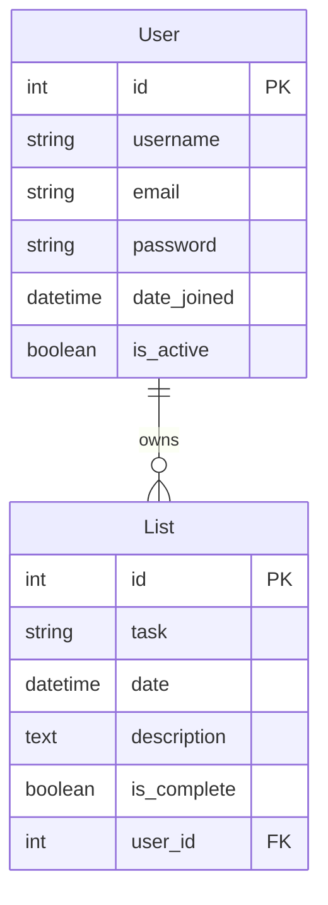

# 📝 To-Do List Application

A modern, responsive Django-based to-do list application with user authentication and a beautiful dark mode interface.

## 📊 ERD Diagram (Models & Relationships)

### Model Relationships:
- **User** (Django's built-in User model)
  - One user can have many tasks (One-to-Many relationship)
  - Handles authentication and user management

- **List** (Task model)
  - Each task belongs to one user
  - Contains task details: name, due date, description, completion status
  - Foreign key relationship to User model

## 👤 User Stories

### **Authentication & Access**
- **As a new user**, I want to create an account so that I can start managing my tasks
- **As a returning user**, I want to log in to access my personal task list
- **As a logged-in user**, I want to log out securely when I'm done

### **Task Management**
- **As a user**, I want to create new tasks with a title, description, and due date
- **As a user**, I want to view all my tasks in an organized list
- **As a user**, I want to see task details including description and due date
- **As a user**, I want to edit my existing tasks to update information
- **As a user**, I want to delete tasks that are no longer needed
- **As a user**, I want to mark tasks as complete or incomplete

### **User Experience**
- **As a user**, I want a clean, modern interface that's easy to navigate
- **As a user**, I want the app to work well on my mobile device
- **As a user**, I want to only see my own tasks (privacy)
- **As a user**, I want clear feedback when I perform actions (create, edit, delete)

### **Navigation & Organization**
- **As a user**, I want easy navigation between different pages
- **As a user**, I want to quickly access the create task form
- **As a user**, I want to see when tasks were created
- **As a user**, I want visual indicators for task completion status

## 🚀 Features

- **User Authentication**: Secure login/logout and user registration
- **Personal Task Management**: Create, read, update, and delete tasks
- **Modern UI**: Clean, responsive dark mode interface
- **Mobile-Friendly**: Optimized for all device sizes
- **User Isolation**: Each user sees only their own tasks
- **Task Details**: Title, description, due date, and completion status
- **Easy Navigation**: Intuitive menu and button layout

## 🛠️ Technology Stack

- **Backend**: Django (Python web framework)
- **Frontend**: HTML5, CSS3, Django Templates
- **Database**: SQLite (development)
- **Authentication**: Django's built-in authentication system
- **Styling**: Custom CSS with CSS Grid and Flexbox
- **Responsive Design**: Mobile-first approach

## 📱 Responsive Design

The application is built with a mobile-first approach and includes:
- Responsive navigation that adapts to screen size
- Touch-friendly buttons and form elements
- Optimized layouts for mobile, tablet, and desktop
- Consistent user experience across all devices

## 🎨 Design System

The application features a comprehensive design system with:
- **Dark Mode Theme**: Modern dark color palette
- **Typography**: Clean, readable fonts with proper hierarchy
- **Spacing**: Consistent spacing system using CSS custom properties
- **Components**: Reusable UI components (buttons, cards, forms)
- **Accessibility**: WCAG AA compliant with proper contrast ratios

## 🔐 Security Features

- User authentication and session management
- CSRF protection on all forms
- User data isolation (users can only access their own tasks)
- Secure password handling with Django's built-in authentication

---

*Built with ❤️ using Django*
